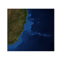

# SEAPY: Python Tools for Oceanographic Analysis

<table summary="Title">
    <tr>
        <td></td>
        <td><h3> A collaborative effort to organize and distribute 
        Python tools for the Oceanographic Community</h3></td>
        <td></td>
    </tr>
</table>

A collaborative effort to organize Python tools for the Oceanographic Community

## The bare minimum

- [Python](http://www.python.org/): Needs no introduction.
- [IPython](http://ipython.scipy.org/): An enhanced interactive Python shell.
- [NumPy](http://numpy.scipy.org): Support for large, multi-dimensional arrays and matrices, along with a large library of high-level mathematical functions to operate on these arrays.
- [SciPy](http://www.scipy.org): Library of algorithms and mathematical tools for the Python programming language.
- [matplotlib](http://matplotlib.sourceforge.net): 2D plotting library which produces publication quality figures in a variety of hardcopy formats and interactive environments.

## Time Series Tools

- [UTide](https://github.com/wesleybowman/UTide): UTide - A project (in its early development phase) to create a Python implementation of the Matlab-based UTide tidal analysis tools.
- [ttide](https://github.com/moflaher/ttide_py): A direct conversion of T_Tide to Python.
- [pytides](https://github.com/sam-cox/pytides): Pytides is small Python package for the analysis and prediction of tides.
- [tappy](http://sourceforge.net/apps/mediawiki/tappy/index.php): Tidal analysis package.
- [dateutil](http://labix.org/python-dateutil): Provides powerful extensions to the standard datetime module.
- [PyWavelets](http://pypi.python.org/pypi/PyWavelets): Wavelet transform module.
- [wafo](http://pypi.python.org/pypi/wafo): Routines for statistical analysis and simulation of random waves and random loads.
- [pandas](http://pypi.python.org/pypi/pandas): Cross-section and time series data analysis toolkit
- [Currents](http://currents.soest.hawaii.edu): CODAS, Lowered ADCP

## Numerical Modeling Tools

- [octant](https://github.com/hetland/octant): Ocean C-grid model seTup and Analysis Toolkit. The toolkit contains general modeling tools for dealing with arrays, diagnosing standard properties, curvilinear grid generation, and interpolation. Specific tools are also included for ROMS and GETM.
- [pyroms](https://github.com/kshedstrom/pyroms): Collection of tools to help with input and output files from the Regional Ocean Modeling System (ROMS).
- [PySeidon](https://github.com/GrumpyNounours/PySeidon): Suite of tools for the tidal energy community and FVCOM users
- [PyFVCOM](https://github.com/pwcazenave/PyFVCOM): PyFVCOM is a collection of various tools and utilities which can be used to extract, analyse and plot input and output files from FVCOM.
- [TracPy](https://github.com/kthyng/Tracpy): Fortran core of Tracmass + Python wrapping around the outside.  TracPy is a toolbox for Lagrangian tracking on top of staggered C grid model output, and is currently set up to use directly with ROMS.
- [pygridgen](https://github.com/hetland/pygridgen): A Python interface to Pavel Sakov's C-based Gridgen Orthogonal Grid Generation Package.
- [okean](https://github.com/martalmeida/okean): Ocean modelling and analysis tools.

## Mapping Tools

- [basemap](http://matplotlib.org/basemap/): Matplotlib Basemap Toolkit.
- [cartopy](http://scitools.org.uk/cartopy/): A library providing cartographic tools for python.
- [folium](http://folium.readthedocs.org/en/latest): Python Data. Leaflet.js Maps.
- [PySAL](http://code.google.com/p/pysal): Python Spatial Analysis Library.
- [sci-wms](https://github.com/sci-wms/sci-wms): A Python WMS service for geospatial gridded data.

## Hydrographic Tools

- [python-ctd](https://pypi.python.org/pypi/ctd): Tools to load hydrographic data as pandas DataFrame with some handy methods for data pre-processing and analysis.
- [python-seawater](https://pypi.python.org/pypi/seawater):  Python version of the CSIRO seawater toolbox (SEAWATER-3.3).
- [python-gsw](https://pypi.python.org/pypi/gsw): A oceanographic toolbox of the International Thermodynamic Equation Of Seawater - 2010, (TEOS-10).
- [pygsw](https://pypi.python.org/pypi/pygsw): C-wrapped alternative to python-gsw.
- [co2sys](https://pypi.python.org/pypi/co2sys): CO2SYS calculates the two carbonate system parameters.
- [narwhal](http://ironicmtn.com/narwhal.html): Experimental tools to organize, analyze, and plot CTD data, including GSW wrappers.

## Data Interface Tools

- [netcdf4-python](http://code.google.com/p/netcdf4-python): Python/numpy interface to netCDF
- [python-blosc](https://github.com/FrancescAlted/python-blosc): Wrapper for the Blosc compressor.
- [PyTables](http://www.pytables.org/moin): Package for managing hierarchical datasets and designed to efficiently and easily cope with extremely large amounts of data.
- [h5py](http://code.google.com/p/h5py): Interface to the HDF5 library.
- [python-hdf4](https://pypi.python.org/pypi/python-hdf4): Python-HDF4: Python interface to the NCSA HDF4 library.
- [PyNIO/PyNGL](http://www.pyngl.ucar.edu): File input/output
- [Pydap](http://pydap.org): Library implementing the Data Access Protocol.
- [pygrib](https://pypi.python.org/pypi/pygrib): python GRIB (editions 1 and 2) reader.

## Plotting (beyond matplotlib)

- [mayavi](http://code.enthought.com/projects/mayavi): Scripting for 3D plotting.
- [gnuplot-py](http://gnuplot-py.sourceforge.net): Package that interfaces to gnuplot, the popular open-source plotting program.
- [PyNGL](http://www.pyngl.ucar.edu): Scientific visualization.
- [ggplot](http://ggplot.yhathq.com): ggplot is a plotting system for Python based on R's ggplot2 and the Grammar of Graphics. It is built for making professional looking, plots quickly with minimal code.
- [bokeh](http://bokeh.pydata.org/en/latest): Bokeh is a Python interactive visualization library that targets modern web browsers for presentation.
- [mpld3](http://mpld3.github.io): The mpld3 project brings together Matplotlib, the popular Python-based graphing library, and D3js, the popular Javascript library for creating interactive data visualizations for the web.

## CDMs

- [paegan](https://pypi.python.org/pypi/paegan): Processing and Analysis for Numerical Data.
- [Iris](http://scitools.org.uk/iris): A Python library for Meteorology and Climatology

## Atmosphere

- [atmqty](http://www.johnny-lin.com/py_pkgs/atmqty/doc): Methods to calculate atmospheric quantities (on the Earth) that are directly derivative (i.e. not requiring time integration or modeling) from standard state variables.
- [airsea](https://github.com/ocefpaf/python-airsea): Translation of the original AIR_SEA toolbox for Matlab.

## Climate

- [PyClimate](http://fisica.ehu.es/pyclimate/PyClimate): Designed to accomplish some usual tasks needed during the analysis of climate variability. It provides functions to handle simple I/O operations, handling of COARDS-compliante netCDF files, EOF analysis, SVD and CCA analysis of coupled data sets, some linear digital filters, kernel based probability density function estimation and access to DCDFLIB.C library
- [climpy](https://code.launchpad.net/~pierregm/scipy/climpy): climpy module.
- [CDAT](http://www2-pcmdi.llnl.gov/cdat): Climate Data Analysis Tools.
- [ccc-gistemp](https://github.com/ClimateCodeFoundation/ccc-gistemp): Reimplementation of GISTEMP in Python for clarity.

## Statistics

- [statsmodels](https://pypi.python.org/pypi/statsmodels): Statistical computations and models for use with SciPy.
- [scikit.learn](http://scikit-learn.sourceforge.net/stable): Module integrating classic machine learning algorithms in the tightly-knit world of scientific Python packages.
- [RPy](https://pypi.python.org/pypi/rpy2): Interface to the R Programming Language.
- [pymc](http://pymc-devs.github.io/pymc): Markov chain Monte Carlo for Python

## Miscellaneous Other Tools

- [oceans](https://pypi.python.org/pypi/oceans): Misc functions for oceanographic data analysis.
- [OWSLib](http://geopython.github.io/OWSLib): OWSLib is a Python package for client programming with Open Geospatial Consortium (OGC) web service (hence OWS) interface standards, and their related content models.
- [pyoos](https://pypi.python.org/pypi/pyoos): A Python library for collecting Met/Ocean observations.
- [scitools](http://code.google.com/p/scitools): Contains many useful tools for scientific computing in Python. The package is built on top of other widely used packages such as NumPy, SciPy, ScientificPython, Matplotlib, Gnuplot, etc.
- [uncertainties](http://pypi.python.org/pypi/uncertainties): Transparent calculations with uncertainties on the quantities involved (aka "error propagation") ; fast calculation of derivatives.
- [numexpr](https://github.com/pydata/numexpr/wiki/Numexpr-Users-Guide): Fast numerical array expression evaluator for Python and NumPy.
- [Bottleneck](http://pypi.python.org/pypi/Bottleneck): Fast NumPy array functions written in Cython.
- [spyderlib](http://code.google.com/p/spyderlib): Spyder is the Scientific PYthon Development EnviRonment.
- [SciPy scikits](http://scikits.appspot.com/scikits): Scipy Toolkits are independent and separately installable projects hosted under a common namespace. Packages that are distributed in this way are here (instead of in monolithic scipy) for at least one of three general reasons. Each of these reasons use the same high-level namespace (scikits).
- [fwrap](http://sourceforge.net/projects/fwrap/files): Wraps FORTRAN code.
- [gmpy](http://code.google.com/p/gmpy): A C-coded Python extension module that wraps the GMP library to provide to Python code fast multiprecision arithmetic (integer, rational, and float), random number generation, advanced number-theoretical functions, and more.
- [SymPy](http://sympy.org): Library for symbolic mathematics.
- [PyEphem](http://rhodesmill.org/pyephem): Scientific-grade astronomical computations.
- [Astropysics](http://packages.python.org/Astropysics): Astrophysics utilities.
- [biopython](http://biopython.org/wiki/Main_Page): Tools for biological computation written in Python.
- [pytroll](http://www.pytroll.org/): Python modules for the reading, interpretation, and writing of weather satellite data.
- [Topical Software](http://www.scipy.org/Topical_Software): SciPy Topical Software.
- [pyferret](http://ferret.pmel.noaa.gov/Ferret/downloads/pyferret/): Ferret is an interactive computer visualization and analysis environment designed to meet the needs of oceanographers and meteorologists.

## Fun

- [slocum](https://github.com/akleeman/slocum): A tool for ocean passage planning.
- [OceanSound](https://github.com/DataSounds/OceanSound): Get the music from oceancolor images, through MODIS satellite.
